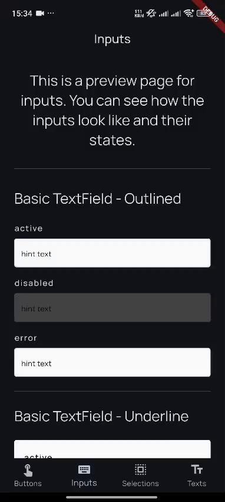
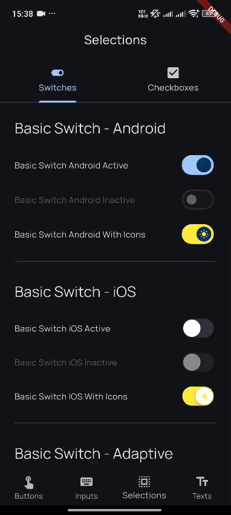
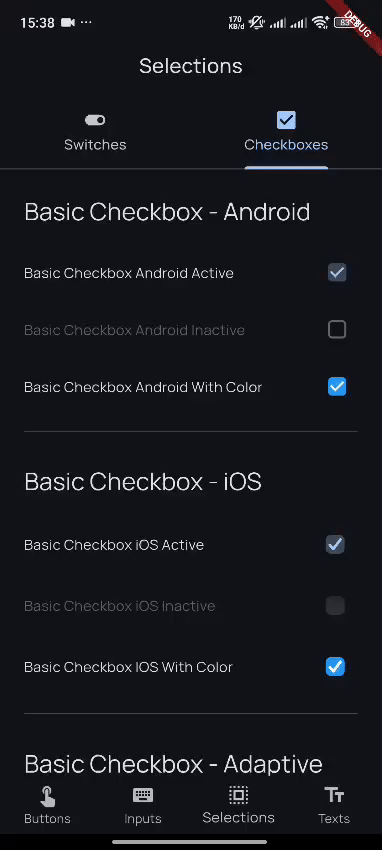

# 🚀 Flutter CleanBLoX Template (Modular)

A **production-ready Flutter starter kit** built with **Clean Architecture**, **BLoC Pattern**, and **Modular Monorepo Structure** — built for scalability, maintainability, and rapid development.

Created with ❤️ by [**Pahnal Aditia**](https://www.linkedin.com/in/pahnaladitia)

---

## 📚 Table of Contents

- [🚀 Flutter CleanBLoX Template (Modular)](#-flutter-cleanblox-template-modular)
  - [📚 Table of Contents](#-table-of-contents)
  - [✨ Features](#-features)
  - [📁 Project Structure](#-project-structure)
  - [⚙️ Getting Started](#️-getting-started)
    - [🛠 Initial Setup](#-initial-setup)
      - [Project Setup Details](#project-setup-details)
    - [▶️ Running the App](#️-running-the-app)
    - [📦 Building APK \& IPA](#-building-apk--ipa)
      - [📱 Android APK](#-android-apk)
      - [🍏 iOS IPA](#-ios-ipa)
  - [Tutorials](#tutorials)
    - [🧩 Basic Button Tutorial](#-basic-button-tutorial)
    - [Overview Widgets](#overview-widgets)
  - [📝 Developer Notes](#-developer-notes)
  - [🚀 Ready to Launch?](#-ready-to-launch)
  - [FYI](#fyi)

---

## ✨ Features

✅ **Monorepo Ready** — Powered by [melos](https://pub.dev/packages/melos) for managing multi-packages 
✅ **Dependency Injection** — Uses [GetIt](https://pub.dev/packages/get_it) for service management  
✅ **Networking** — Built with [Dio](https://pub.dev/packages/dio) for robust API handling  
✅ **Clean Architecture** — Clear separation of `data`, `domain`, and `presentation` layers  
✅ **BLoC State Management** — Built using [flutter_bloc](https://pub.dev/packages/flutter_bloc)  
 
✅ **Flavor Support** — Easily switch between `staging` and `production` builds  
✅ **CI/CD Integrated** — GitHub Actions ready for automated signed builds in Android and iOS  
✅ **App Links & Deep Linking** — Universal links for Android & iOS
✅ **Rich UI Components** — Custom widgets in `shared/` for consistent design  
✅ **Testing & Debugging** — Includes [Chucker Flutter](https://pub.dev/packages/chucker_flutter) and [Cote Network Logger](https://pub.dev/packages/cote_network_logger) for network debugging  
✅ **Localization Support** — Built-in support for internationalization using [intl](https://pub.dev/packages/intl)  
✅ **Error Logging** — Integrated with [Sentry](https://docs.sentry.io/platforms/flutter/) for error tracking  
✅ **Routing** — Uses [go_router](https://pub.dev/packages/go_router) for declarative routing  
✅ **UI Tooling** — Includes [Flutter Launcher Icons](https://pub.dev/packages/flutter_launcher_icons) and [Flutter Native Splash](https://pub.dev/packages/flutter_native_splash) for app branding
✅ **Extensive Documentation** — Detailed setup and usage guides in the `docs/` directory

---

## 📁 Project Structure

```bash
repo/
├── application/           # App entry point and router
├── core/                  # Core logic & contracts (e.g., services, interfaces)
├── shared/                # Global widgets, styles, extensions, utilities
├── features/
│   ├── auth/              # Authentication feature module
│   └── home/              # Home feature module
├── pubspec.yaml           # Root pubspec
├── melos.yaml             # Melos scripts & workspace
└── .melos.yaml            # Melos config
```

---

## ⚙️ Getting Started

### 🛠 Initial Setup

```bash
# Clone the repo
git clone https://github.com/fahnaladitia/flutter_clean_blox_template_modular.git

# Install dependencies for all packages
melos bootstrap
```

#### Project Setup Details

- Package Name & Flavor Setup:
See [SETUP.md](docs/SETUP.md) for customizing your app’s name and flavors.

- App Links & Deep Linking:
See [APPLINKS.md](docs/APPLINKS.md) for universal link configuration for Android & iOS.

- CI/CD Configuration and Automated Builds:
See [ANDROID_CI.md](docs/ANDROID_CI.md) for setting up GitHub Actions for automated builds.

### ▶️ Running the App

```bash
# Staging environment
melos run:debug:staging
melos run:release:staging

# Production environment
melos run:debug:production
melos run:release:production
```

### 📦 Building APK & IPA

#### 📱 Android APK

```bash
# Build staging APK
melos run build:staging:apk

# Build production APK
melos run build:production:apk
```

#### 🍏 iOS IPA

```bash
# Staging build
melos run build:staging:ios
flutter build ipa --obfuscate --split-debug-info=out/android --flavor staging -t lib/main_staging.dart

# Production build
flutter build ios --flavor production -t lib/main_production.dart
flutter build ipa --obfuscate --split-debug-info=out/android --flavor production -t lib/main_production.dart
```

---

## Tutorials

### 🧩 Basic Button Tutorial

A guide to using the BasicButton widget in your Flutter app with rich customization for style, size, icon, width, and event state.
See [BASIC_BUTTON_TUTORIAL.md](docs/BASIC_BUTTON_TUTORIAL.md) for a comprehensive guide on using the `BasicButton` widget, including constructor parameters, available sizes, states, and example usages.
 
### Overview Widgets

<p float="left">
  
  
  
  
</p>

---

## 📝 Developer Notes

- **Dependency Injection**: [GetIt](https://pub.dev/packages/get_it)  
- **Networking**: [Dio](https://pub.dev/packages/dio)  
- **Error Logging**: [Sentry](https://docs.sentry.io/platforms/flutter/)  
- **Localization**: [intl](https://pub.dev/packages/intl)  
- **Routing**: [go_router](https://pub.dev/packages/go_router)  
- **Testing & Logging**: [Chucker Flutter](https://pub.dev/packages/chucker_flutter), [Cote Network Logger](https://pub.dev/packages/cote_network_logger)  
- **UI Tooling**: [Flutter Launcher Icons](https://pub.dev/packages/flutter_launcher_icons), [Flutter Native Splash](https://pub.dev/packages/flutter_native_splash)  
- **Flavor Management**: [Flutter Flavors](https://docs.flutter.dev/deployment/flavors)  
- **CI/CD**: GitHub Actions integrated  
- **App Link Setup**: [App & Universal Links](https://docs.flutter.dev/cookbook/navigation/set-up-app-links)
- **Monorepo Management**: [melos](https://pub.dev/packages/melos) for managing multi-packages

---

## 🚀 Ready to Launch?

Fork this template, plug in your logic, and ship your next big thing! 🎯


## FYI
This template is designed for  **modular monorepo structure** and **production-ready** applications. It provides a solid foundation for building scalable and maintainable Flutter applications with a focus on Clean Architecture and BLoC pattern.
If you are looking for a **monolithic structure** or a **simple starter kit**, consider using the [Flutter CleanBLoX Template](https://github.com/fahnaladitia/flutter_clean_blox_template_monolithic).